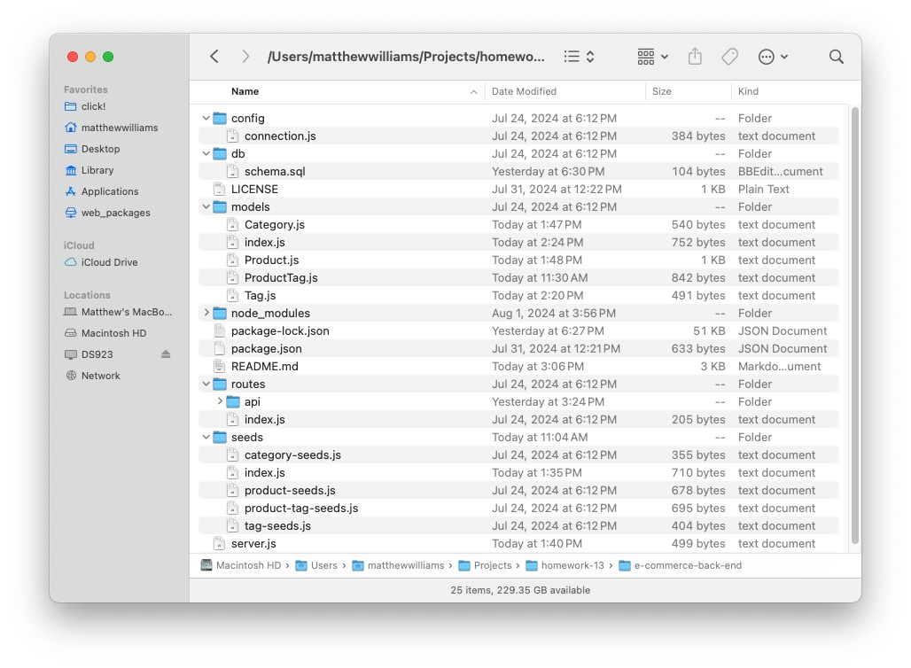

# E-Commerce Back End

## License

MIT License

## Description
This repo includes code for the back end of an e-commerce site. Starter code and seed data was provided by the instructor. The back end allows for the retrieval (GET), addition (POST), updating (PUT), and deletion (DELETE) of categories (e.g. "shirts"), products (e.g. "Plain T-Shirt"), and tags (e.g., "white") in the database. Though not part of this assignments, additional constraints can and should be added to the models, particularly to prevent duplication.

## Table of Contents
- [Installation](#installation)
- [Usage](#usage)
- [License](#license)
- [Contributing](#contributing)
- [Tests](#tests)
- [Questions](#questions)

## Installation
As a back-end application, E-Commerce Back End does not require installation, per se, but to use it, download this repo being careful not to change the file and folder structure as shown in the image below.

## Usage
To use E-Commerce Back End, create (or edit) an .env file with your username and password. You can see an example of the structure of a .env file in the image below. When you have prepared a .env file, use these commands:

    npm install [installs dependences]
    psql -U postgres [opens PostgreSQL; provide your password when asked]
    \i db/schema.sql [creates the database called "ecommerce_db"]
    \q to exit the PostgreSQL CLI
    node seeds/index.js [seeds the database that was created by schema.sql]
    node server [to start the server]

You can then test the E-Commerce Back End using a browser or using Insomnia or a similar application. Make sure, of course, that for POST, PUT, and DELETE requests that your tests make include a body specifying the category, product, or tag to be added, updated, or deleted. To see a video of the application routes being tested in Insomnia, click on the link below. Note: Depending on the environment in which you're viewing this README file, you may not be able to view the video online, in which case, you should be able to download the video and view it locally. A copy can also be found in the assets folder when you download the repo.

## Contributing
To contribute to E-Commerce Back End, clone this repository locally and commit your code to a separate branch.

## Tests
If you are making core library changes, please write unit tests for your code and ensure that everything is working correctly before opening a pull request.

## Questions
You can see my github repositories at [MatthewWilliamsCMH](https://github.com/MatthewWilliamsCMH/).  
Drop me a line at [matthewwilliamscmh@icloud.com](mailto:matthewwilliamscmh@icloud.com).